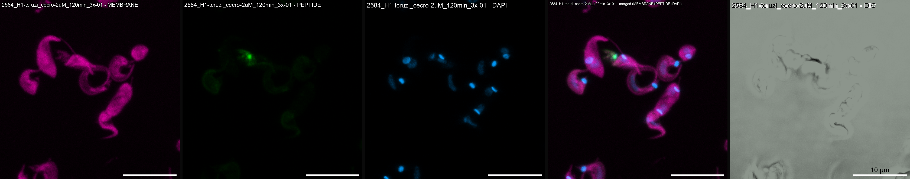

## initial_image_processing_VIS

Use this repo to automate creating PNG files from CZI microscopy data to easily visualize them. (works for MIPs, need to validate the successful workflow of non-MIPs)

---

### Visualization includes:
1. Scale-bar configuration  
2. Color configuration of each channel including naming  
3. Panel creation of specified channels  

**Example output:**

---

### Step-by-step instructions:
- [ ] Add `raw_data` folder and subsequent `.czi` files  
- [ ] Add `python_results` folder
- [ ] Delete the `example_figures` folder (not necessity for script to work)
- [ ] Configure the variables to work for your use-case  
- [ ] Add description of experiment below  

---

### Description of Experiment
n/a

### Current Bugs to Fix 
no bugs
